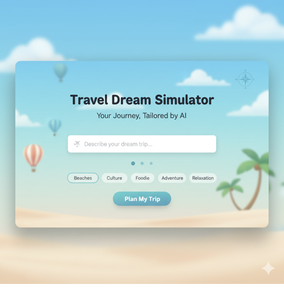
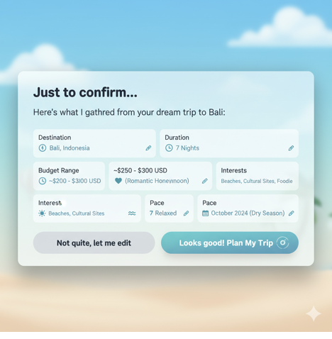
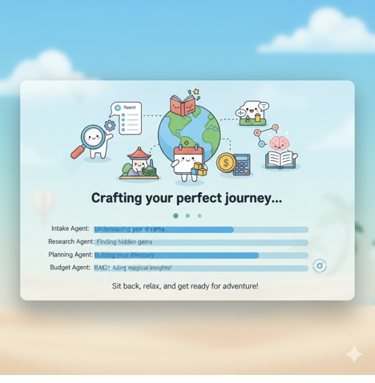
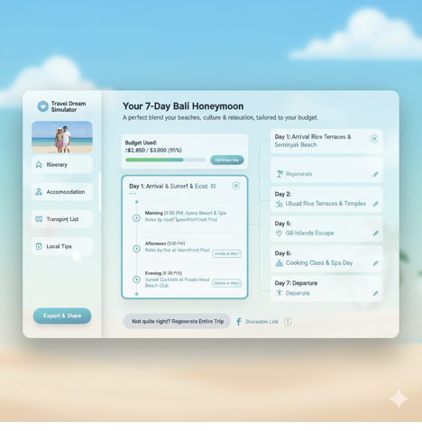

Travel Dream Simulator - Design Mock-up
Let's start with the overall feel for the landing/input page. Imagine a clean, inviting interface that immediately conveys a sense of wanderlust and ease.
1. Landing & Input Phase Mock-up

The initial screen would greet the user with a gentle gradient, perhaps from a soft sky blue to a pale sandy beige, with subtle, dreamy travel-related iconography.

 
The main input field is prominent and encourages natural language. Below it, quick-select "interest" bubbles (like "Beaches," "Culture," "Foodie") with soft pastel colors allow users to quickly add preferences without extensive typing.
2. Clarification Phase Mock-up

After the initial input, the system would present a clear, conversational summary of the extracted parameters, allowing the user to confirm or adjust. This would be presented in a clean, card-like format.

 
3. Processing Phase Mock-up

While the agents are at work, a fun and engaging loading screen will keep the user informed and entertained, fitting the relaxed theme.
 

4. Itinerary Display & Interaction Mock-up (Overview)

Once generated, the itinerary should be easy to digest, visually appealing, and highly interactive, retaining the soft blue and light color palette. The main layout would feature a sidebar for global navigation and filters, and the main content area for the day-by-day plan.
